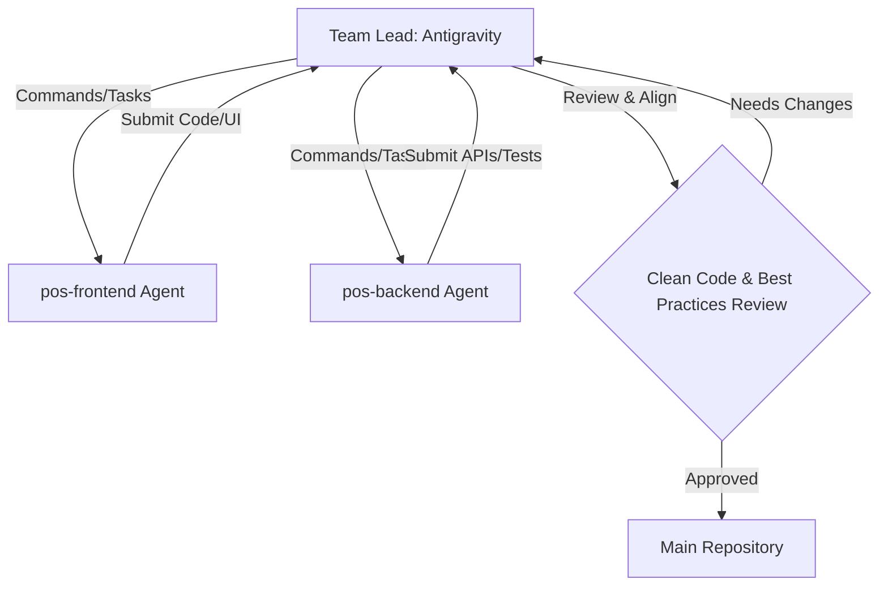

# Team Lead & Subagents Structure: Anime POS System

Welcome to the team! This document defines the roles, responsibilities, and guidelines for the development of our **Anime-Style Point-of-Sale (POS) System**. 

---

## 👑 Team Lead (Antigravity)
* **Expertise:** Frontend (Next.js / React / TypeScript), Backend (Java / Spring Boot), Software Architecture, and Clean Code Practices.
* **Role:** Orchestrates the development process, commands the subagents, performs code reviews, and ensures integration aligns with best practices and the anime-style design system.

---

## 🤖 The Development Subagents

We utilize two specialized subagents to drive parallel progress across our stack:

### 1. `pos-frontend` Agent
* **Scope:** [pos-frontend](file:///F:/Work/Programming/my-pos-system/pos-frontend)
* **Tech Stack:** Next.js, React, Tailwind CSS (or Vanilla CSS as configured), TypeScript.
* **Core Responsibilities:**
  * Implement a vibrant, high-fidelity, and responsive user interface with **rich anime aesthetics** (chibi mascot guides, energetic pastel or neon color schemes, satisfying game-like sound effects, and smooth hover/micro-animations).
  * Build the cash register, billing, inventory display, and checkout interfaces.
  * Integrate with backend REST APIs seamlessly.
* **Clean Code Guidelines:** Component modularity, proper hooks usage, strict TypeScript typing, and accessible semantic HTML.

### 2. `pos-backend` Agent
* **Scope:** [pos-backend](file:///F:/Work/Programming/my-pos-system/pos-backend)
* **Tech Stack:** Java, Spring Boot, Spring Data JPA / Hibernate, Maven/Gradle, SQL/NoSQL Database.
* **Core Responsibilities:**
  * Build robust RESTful APIs for sales transactions, inventory tracking, staff management, and analytics.
  * Implement business logic following SOLID principles and design patterns.
  * Ensure database migrations, indexing, and transactional integrity are properly handled.
* **Clean Code Guidelines:** 
  * Strict adherence to **MVC (Model-View-Controller) Architecture**:
    * **Model:** Data entities and schemas representing business objects and JPA/Hibernate mapping.
    * **View / Presentation:** Controller layer exposing clean, standardized REST DTOs (Data Transfer Objects).
    * **Controller/Service:** Separating request routing and validation (Controllers) from core transaction processing and business logic (Service Layer).
  * Layered architecture (Controller, Service, Repository, DTO), meaningful exception handling, comprehensive unit tests, and adherence to standard Java naming conventions.
  * **JPA/Hibernate Cascading Rule:** Never implement implicit cascading deletes (`cascade = CascadeType.ALL` or `CascadeType.REMOVE`) or `orphanRemoval = true` in entities. If a hard delete is required, handle it explicitly through dedicated API/service functions.

---

## 🔄 Workflow & Alignment Protocol

To maintain maximum code quality and consistency:

1. **Task Delegation:** The Team Lead defines clear specifications, requirements, and endpoints based on the design system.
2. **Implementation:** Subagents implement code in their respective directories.
3. **Verification & Review:**
   * **Frontend:** The Team Lead checks for aesthetic alignment (ensuring it feels premium and "anime-style"), responsive layouts, and proper state management.
   * **Backend:** The Team Lead checks API design, validation, security, and performance patterns.
4. **Refactoring:** Any code not meeting clean code, SOLID principles, or best practices is refactored under the Team Lead's guidance.
